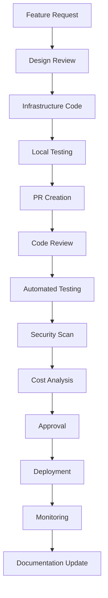

# Infrastructure and IaC Guide

**Version**: 1.0  
**Last Updated**: 2026-03-01  
**Purpose**: Comprehensive infrastructure and Infrastructure as Code strategy for the Mystira monorepo

## Overview

This guide establishes the complete infrastructure and IaC strategy for the Mystira monorepo, covering current state analysis, multi-cloud strategy, best practices, and continuous improvement. It serves as the central reference for infrastructure team members and provides key principles for development teams.

## Current Infrastructure Landscape

### 📊 **Infrastructure Assessment**

#### **Current Architecture Components**

- **Terraform/Terragrunt**: 48+ .tf files for Azure resource provisioning
- **Kubernetes**: 36+ YAML manifests with Kustomize structure
- **Docker**: 5 service-specific Dockerfiles
- **Two-tier Deployment Model**: Terragrunt for infrastructure, Harness GitOps for applications
- **Azure Services**: AKS, PostgreSQL, Redis, Service Bus, Key Vault, AI services

#### **Infrastructure Strengths**

- **Well-Organized Structure**: 3-tier resource group organization
- **Comprehensive Modules**: Terraform modules for all services
- **Kubernetes Integration**: Proper service accounts and networking
- **Security Integration**: Azure Workload Identity
- **Documentation**: Existing ADRs covering infrastructure decisions

#### **Current Gaps**

- **No Unified IaC Documentation**: Missing comprehensive guide
- **Security Best Practices**: Limited security documentation
- **Monitoring Strategy**: No comprehensive monitoring guide
- **Disaster Recovery**: Limited backup and recovery strategies
- **Cost Optimization**: No cost management guidance
- **Testing Strategies**: No infrastructure testing framework
- **Multi-Cloud Strategy**: No multi-cloud planning
- **Compliance Framework**: No governance documentation

### 🏗️ **Two-Tier Deployment Model**

```text
┌─────────────────────────────────────────────────────────────────────────────┐
│                         MYSTIRA DEPLOYMENT STACK                            │
├─────────────────────────────────────────────────────────────────────────────┤
│                                                                             │
│  ┌───────────────────────────────────────────────────────────────────────┐  │
│  │                    APPLICATION LAYER (Harness GitOps)                 │  │
│  │  • Kubernetes Deployments, Services, ConfigMaps                       │  │
│  │  • Application rollouts and rollbacks                                 │  │
│  │  • GitOps sync from Git → Kubernetes                                  │  │
│  │  • Canary/Blue-Green deployments                                      │  │
│  └───────────────────────────────────────────────────────────────────────┘  │
│                                    ▲                                        │
│                                    │ deploys to                             │
│                                    │                                        │
│  ┌───────────────────────────────────────────────────────────────────────┐  │
│  │                   INFRASTRUCTURE LAYER (Terragrunt)                   │  │
│  │  • AKS clusters, PostgreSQL, Redis, Storage                          │  │
│  │  • Virtual Networks, Subnets, NSGs                                    │  │
│  │  • Azure AI, Key Vault, Service Bus                                   │  │
│  │  • DNS zones, SSL certificates infrastructure                         │  │
│  └───────────────────────────────────────────────────────────────────────┘  │
│                                                                             │
└─────────────────────────────────────────────────────────────────────────────┘
```

### 📋 **Resource Group Organization**

Per [ADR-0017](../architecture/adr/0017-resource-group-organization-strategy.md):

#### **Tier 1: Core Resource Group** (`mys-{env}-core-rg-san`)

- Virtual Network and Subnets
- AKS Cluster
- PostgreSQL Flexible Server (shared)
- Redis Cache (shared)
- Service Bus Namespace (shared)
- Log Analytics Workspace

#### **Tier 2: Service Resource Groups** (`mys-{env}-{service}-rg-san`)

- **chain-rg**: Chain service (Identity, Key Vault, App Insights)
- **publisher-rg**: Publisher service (Identity, Key Vault, App Insights)
- **story-rg**: Story Generator (Identity, Key Vault, App Insights)
- **admin-rg**: Admin API (Identity, Key Vault, App Insights)
- **app-rg**: App (Static Web App, App Service)

#### **Tier 3: Cross-Environment Shared**

- DNS zones and certificates
- Shared monitoring resources
- Cross-environment networking

## IaC Tools and Frameworks

### 🔷 **Terraform/Terragrunt**

#### **Current Implementation**

- **Terragrunt**: For dependency management and configuration
- **Terraform Modules**: Reusable infrastructure components
- **State Management**: Remote state storage in Azure
- **Environment Management**: Separate configurations per environment

#### **Best Practices**

##### **Module Structure**

```hcl
# terragrunt.hcl
terraform {
  source = "git::git@github.com:phoenixvc/mystira.workspace.git//infra/terraform/modules/aks?ref=v1.0.0"
}

inputs = {
  resource_group_name = dependency.core.outputs.resource_group_name
  location           = local.env_vars.location
  cluster_name       = "${local.env_vars.prefix}-aks"

  node_count = local.env_vars.aks.node_count
  vm_size    = local.env_vars.aks.vm_size
}

dependency "core" {
  config_path = "../core"
}
```

##### **Variable Management**

```hcl
# env_vars.hcl
locals {
  env_vars = read_terragrunt_config(find_in_parent_folders("env.hcl"))

  inputs = {
    resource_group_name = "${local.env_vars.locals.prefix}-core-rg-san"
    location           = local.env_vars.locals.location

    aks = {
      node_count = local.env_vars.locals.aks.node_count
      vm_size    = local.env_vars.locals.aks.vm_size
    }
  }
}
```

##### **State Management**

```hcl
# remote_state.tf
terraform {
  backend "azurerm" {
    resource_group_name  = "mys-tfstate-rg"
    storage_account_name = "mystfstate"
    container_name       = "terraform"
    key                  = "core/terraform.tfstate"
  }
}
```

### 🟨 **Kubernetes and Kustomize**

#### **Current Implementation**

- **Base Manifests**: Shared Kubernetes configurations
- **Environment Overlays**: Environment-specific customizations
- **Service Mesh**: Istio integration for service communication
- **Workload Identity**: Azure AD integration for pod authentication

#### **Best Practices**

##### **Base Structure**

```yaml
# kustomization.yaml
apiVersion: kustomize.config.k8s.io/v1beta1
kind: Kustomization

resources:
  - namespace.yaml
  - service-accounts.yaml
  - configmaps.yaml
  - deployments.yaml
  - services.yaml
  - ingress.yaml

commonLabels:
  app.kubernetes.io/name: mystira
  app.kubernetes.io/component: admin-api
  app.kubernetes.io/managed-by: kustomize
```

##### **Environment Overlay**

```yaml
# overlays/prod/kustomization.yaml
apiVersion: kustomize.config.k8s.io/v1beta1
kind: Kustomization

bases:
  - ../../base

patchesStrategicMerge:
  - deployment-patch.yaml
  - ingress-patch.yaml

replicas:
  - name: admin-api
    count: 3

images:
  - name: admin-api
    newTag: v1.2.0
```

##### **Service Account Configuration**

```yaml
# service-accounts.yaml
apiVersion: v1
kind: ServiceAccount
metadata:
  name: admin-api-sa
  namespace: mystira
  annotations:
    azure.workload.identity/client-id: "00000000-0000-0000-0000-000000000000"
    azure.workload.identity/tenant-id: "00000000-0000-0000-0000-000000000000"
---
apiVersion: v1
kind: ServiceAccount
metadata:
  name: story-generator-sa
  namespace: mystira
  annotations:
    azure.workload.identity/client-id: "00000000-0000-0000-0000-000000000001"
    azure.workload.identity/tenant-id: "00000000-0000-0000-0000-000000000000"
```

### 🐳 **Docker Containerization**

#### **Current Implementation**

- **Multi-stage Builds**: Optimized Docker images
- **Service-Specific Dockerfiles**: Customized per service
- **Base Images**: Standardized base images
- **Security Scanning**: Integrated vulnerability scanning

#### **Best Practices**

##### **Multi-stage Dockerfile**

```dockerfile
# Dockerfile for Admin API
FROM mcr.microsoft.com/dotnet/sdk:10.0 AS build
WORKDIR /src

# Copy csproj and restore dependencies
COPY ["Mystira.Admin.Api/Mystira.Admin.Api.csproj", "Mystira.Admin.Api/"]
COPY ["Mystira.Admin.Domain/Mystira.Admin.Domain.csproj", "Mystira.Admin.Domain/"]
COPY ["Mystira.Admin.Infrastructure/Mystira.Admin.Infrastructure.csproj", "Mystira.Admin.Infrastructure/"]
RUN dotnet restore "Mystira.Admin.Api/Mystira.Admin.Api.csproj"

# Copy everything and build
COPY . .
WORKDIR "/src/Mystira.Admin.Api"
RUN dotnet build "Mystira.Admin.Api.csproj" -c Release -o /app/build

FROM build AS publish
RUN dotnet publish "Mystira.Admin.Api.csproj" -c Release -o /app/publish

FROM mcr.microsoft.com/dotnet/aspnet:10.0 AS final
WORKDIR /app
COPY --from=publish /app/publish .
ENTRYPOINT ["dotnet", "Mystira.Admin.Api.dll"]
```

##### **Security Scanning Integration**

```yaml
# .github/workflows/docker-security.yml
name: Docker Security Scan

on:
  push:
    branches: [main, develop]

jobs:
  security-scan:
    runs-on: ubuntu-latest
    steps:
      - name: Checkout Code
        uses: actions/checkout@v4

      - name: Run Trivy Scanner
        uses: aquasecurity/trivy-action@master
        with:
          image-ref: "mystira/admin-api:latest"
          format: "sarif"
          output: "trivy-results.sarif"

      - name: Upload Results
        uses: github/codeql-action/upload-sarif@v2
        with:
          sarif_file: "trivy-results.sarif"
```

### 🔧 **Harness GitOps Integration**

#### **Current Implementation**

- **Git Repository**: Single source of truth for Kubernetes manifests
- **Automated Sync**: Git changes automatically sync to Kubernetes
- **Rollback Support**: Automated rollback capabilities
- **Progressive Deployments**: Canary and blue-green deployments

#### **Best Practices**

##### **GitOps Configuration**

```yaml
# harness-agent.yaml
apiVersion: v1
kind: Secret
metadata:
  name: harness-agent-secret
  namespace: harness-delegate
type: Opaque
data:
  ACCOUNT_ID: <base64-encoded-account-id>
  API_KEY: <base64-encoded-api-key>
---
apiVersion: apps/v1
kind: Deployment
metadata:
  name: harness-delegate
  namespace: harness-delegate
spec:
  replicas: 1
  selector:
    matchLabels:
      app: harness-delegate
  template:
    metadata:
      labels:
        app: harness-delegate
    spec:
      containers:
        - name: harness-delegate
          image: harness/delegate:latest
          env:
            - name: ACCOUNT_ID
              valueFrom:
                secretKeyRef:
                  name: harness-agent-secret
                  key: ACCOUNT_ID
            - name: API_KEY
              valueFrom:
                secretKeyRef:
                  name: harness-agent-secret
                  key: API_KEY
```

## Multi-Cloud Strategy

### 🌍 **Multi-Cloud Vision**

#### **Current State: Azure-Centric**

- **Primary Provider**: Microsoft Azure
- **Services**: AKS, PostgreSQL, Redis, Service Bus, Key Vault
- **Management**: Terraform/Terragrunt for Azure resources
- **Deployment**: Harness GitOps to Azure Kubernetes

#### **Future Multi-Cloud Strategy**

##### **Phase 1: Azure Optimization (Current)**

- Optimize existing Azure infrastructure
- Implement advanced Azure services
- Enhance security and compliance
- Improve cost management

##### **Phase 2: Hybrid Cloud (6-12 months)**

- **AWS Integration**: Add AWS for specific workloads
- **Google Cloud**: Integrate GCP for AI/ML workloads
- **Multi-Cluster Management**: Cross-cloud Kubernetes management
- **Data Replication**: Cross-cloud data strategies

##### **Phase 3: Full Multi-Cloud (12-24 months)**

- **Workload Distribution**: Optimal cloud provider per workload
- **Disaster Recovery**: Multi-cloud disaster recovery
- **Cost Optimization**: Dynamic cloud cost management
- **Vendor Independence**: Reduced vendor lock-in

### 🔧 **Multi-Cloud Tool Strategy**

#### **Infrastructure as Code**

```hcl
# Multi-cloud provider configuration
terraform {
  required_providers {
    azurerm = {
      source  = "hashicorp/azurerm"
      version = "~> 3.0"
    }
    aws = {
      source  = "hashicorp/aws"
      version = "~> 5.0"
    }
    google = {
      source  = "hashicorp/google"
      version = "~> 4.0"
    }
  }
}

# Provider configuration
provider "azurerm" {
  features {}
}

provider "aws" {
  region = var.aws_region
}

provider "google" {
  project = var.gcp_project
  region  = var.gcp_region
}
```

#### **Multi-Cloud Kubernetes**

```yaml
# Multi-cluster management
apiVersion: cluster.x-k8s.io/v1beta1
kind: Cluster
metadata:
  name: mystira-azure-cluster
  namespace: mystira
spec:
  infrastructureRef:
    name: mystira-azure-infrastructure
  controlPlaneRef:
    name: mystira-azure-control-plane
---
apiVersion: cluster.x-k8s.io/v1beta1
kind: Cluster
metadata:
  name: mystira-aws-cluster
  namespace: mystira
spec:
  infrastructureRef:
    name: mystira-aws-infrastructure
  controlPlaneRef:
    name: mystira-aws-control-plane
```

### 📊 **Multi-Cloud Decision Matrix**

| Workload Type        | Primary Cloud      | Secondary Cloud | Rationale                     |
| -------------------- | ------------------ | --------------- | ----------------------------- |
| **Web Applications** | Azure (AKS)        | AWS (EKS)       | Azure integration, AWS backup |
| **AI/ML Workloads**  | Google Cloud       | Azure           | GCP AI superiority            |
| **Data Analytics**   | AWS (Redshift)     | Azure           | AWS analytics maturity        |
| **Edge Computing**   | Azure (Edge Zones) | AWS (Outposts)  | Azure edge presence           |
| **Blockchain**       | Azure              | AWS             | Azure blockchain services     |
| **Mobile Backend**   | Azure              | Google Cloud    | Azure mobile integration      |

## Infrastructure Components Deep Dive

### 🔷 **Azure Infrastructure**

#### **AKS Cluster Configuration**

```hcl
# modules/aks/main.tf
resource "azurerm_kubernetes_cluster" "aks" {
  name                = var.cluster_name
  location            = var.location
  resource_group_name = var.resource_group_name
  dns_prefix          = var.dns_prefix

  default_node_pool {
    name       = "system"
    node_count = var.system_node_count
    vm_size    = var.system_vm_size

    upgrade_settings {
      max_surge = "10%"
    }
  }

  node_resource_group = "${var.resource_group_name}-nrg"

  identity {
    type = "SystemAssigned"
  }

  network_profile {
    network_plugin    = "azure"
    network_policy    = "calico"
    dns_service_ip    = "10.0.0.10"
    service_cidr      = "10.0.0.0/16"
    docker_bridge_cidr = "172.17.0.1/16"
  }

  addon_profile {
    oms_agent {
      enabled = true
      log_analytics_workspace_id = var.log_analytics_workspace_id
    }

    azure_policy {
      enabled = true
    }

    ingress_application_gateway {
      enabled = true
      gateway_name = "${var.cluster_name}-agw"
    }
  }

  azure_active_directory_role_based_access_control {
    enabled = true
    azure_rbac_enabled = true
    admin_group_object_ids = var.admin_group_object_ids
  }
}
```

#### **Database Configuration**

```hcl
# modules/postgresql/main.tf
resource "azurerm_postgresql_flexible_server" "postgres" {
  name                = var.server_name
  resource_group_name = var.resource_group_name
  location            = var.location

  version            = var.postgres_version
  administrator_login = var.admin_username
  administrator_password = var.admin_password

  storage_mb = var.storage_mb
  sku_name   = var.sku_name

  backup_retention_days        = var.backup_retention_days
  geo_redundant_backup_enabled = var.geo_redundant_backup_enabled

  high_availability {
    mode = var.high_availability_mode
  }

  maintenance_window {
    day_of_week  = var.maintenance_day
    start_hour   = var.maintenance_hour
    start_minute = var.maintenance_minute
  }

  delegated_subnet_id = var.subnet_id
  private_dns_zone_id  = var.private_dns_zone_id

  tags = var.tags
}

resource "azurerm_postgresql_flexible_server_database" "database" {
  name                = var.database_name
  server_name         = azurerm_postgresql_flexible_server.postgres.name
  resource_group_name = var.resource_group_name
  charset             = var.charset
  collation           = var.collation
}
```

#### **Networking Configuration**

```hcl
# modules/vnet/main.tf
resource "azurerm_virtual_network" "vnet" {
  name                = var.vnet_name
  address_space       = var.address_space
  location            = var.location
  resource_group_name = var.resource_group_name

  tags = var.tags
}

resource "azurerm_subnet" "aks" {
  name                 = "aks-subnet"
  resource_group_name  = var.resource_group_name
  virtual_network_name = azurerm_virtual_network.vnet.name
  address_prefixes     = var.aks_subnet_address_prefixes

  delegation {
    name = "aks-delegation"
    service_delegation {
      name    = "Microsoft.ContainerService/managedClusters"
      actions = ["Microsoft.Network/virtualNetworks/subnets/action"]
    }
  }
}

resource "azurerm_subnet" "postgres" {
  name                 = "postgres-subnet"
  resource_group_name  = var.resource_group_name
  virtual_network_name = azurerm_virtual_network.vnet.name
  address_prefixes     = var.postgres_subnet_address_prefixes

  delegation {
    name = "postgres-delegation"
    service_delegation {
      name    = "Microsoft.DBforPostgreSQL/flexibleServers"
      actions = ["Microsoft.Network/virtualNetworks/subnets/action"]
    }
  }
}
```

### 🟨 **Kubernetes Infrastructure**

#### **Service Mesh Configuration**

```yaml
# service-mesh/destination-rules.yaml
apiVersion: networking.istio.io/v1beta1
kind: DestinationRule
metadata:
  name: admin-api-destination-rule
  namespace: mystira
spec:
  host: admin-api
  trafficPolicy:
    connectionPool:
      tcp:
        maxConnections: 100
      http:
        http1MaxPendingRequests: 50
        maxRequestsPerConnection: 10
    loadBalancer:
      simple: LEAST_CONN
    circuitBreaker:
      consecutiveErrors: 3
      interval: 30s
      baseEjectionTime: 30s
---
apiVersion: networking.istio.io/v1beta1
kind: DestinationRule
metadata:
  name: story-generator-destination-rule
  namespace: mystira
spec:
  host: story-generator
  trafficPolicy:
    connectionPool:
      tcp:
        maxConnections: 50
      http:
        http1MaxPendingRequests: 25
        maxRequestsPerConnection: 5
    loadBalancer:
      simple: ROUND_ROBIN
```

#### **Network Policies**

```yaml
# network-policy.yaml
apiVersion: networking.k8s.io/v1
kind: NetworkPolicy
metadata:
  name: admin-api-network-policy
  namespace: mystira
spec:
  podSelector:
    matchLabels:
      app: admin-api
  policyTypes:
    - Ingress
    - Egress
  ingress:
    - from:
        - namespaceSelector:
            matchLabels:
              name: ingress-nginx
        - podSelector:
            matchLabels:
              app: story-generator
      ports:
        - protocol: TCP
          port: 80
        - protocol: TCP
          port: 443
  egress:
    - to:
        - podSelector:
            matchLabels:
              app: postgres
      ports:
        - protocol: TCP
          port: 5432
    - to: []
      ports:
        - protocol: TCP
          port: 53
        - protocol: UDP
          port: 53
        - protocol: TCP
          port: 443
```

#### **Ingress Configuration**

```yaml
# ingress.yaml
apiVersion: networking.k8s.io/v1
kind: Ingress
metadata:
  name: admin-api-ingress
  namespace: mystira
  annotations:
    kubernetes.io/ingress.class: "nginx"
    cert-manager.io/cluster-issuer: "letsencrypt-prod"
    nginx.ingress.kubernetes.io/rate-limit: "100"
    nginx.ingress.kubernetes.io/rate-limit-window: "1m"
    nginx.ingress.kubernetes.io/enable-cors: "true"
    nginx.ingress.kubernetes.io/cors-allow-origin: "https://app.mystira.dev"
    nginx.ingress.kubernetes.io/cors-allow-methods: "GET, POST, PUT, DELETE, OPTIONS"
    nginx.ingress.kubernetes.io/cors-allow-headers: "DNT,User-Agent,X-Requested-With,If-Modified-Since,Cache-Control,Content-Type,Range,Authorization"
spec:
  tls:
    - hosts:
        - api.mystira.dev
      secretName: admin-api-tls
  rules:
    - host: api.mystira.dev
      http:
        paths:
          - path: /
            pathType: Prefix
            backend:
              service:
                name: admin-api
                port:
                  number: 80
```

### 🐳 **Container Infrastructure**

#### **Multi-Stage Build Optimization**

```dockerfile
# Optimized Dockerfile for Story Generator
FROM mcr.microsoft.com/dotnet/sdk:10.0-alpine AS build
WORKDIR /src

# Copy and cache dependencies
COPY ["Mystira.StoryGenerator/Mystira.StoryGenerator.csproj", "Mystira.StoryGenerator/"]
COPY ["Mystira.StoryGenerator.Domain/Mystira.StoryGenerator.Domain.csproj", "Mystira.StoryGenerator.Domain/"]
COPY ["Mystira.StoryGenerator.Infrastructure/Mystira.StoryGenerator.Infrastructure.csproj", "Mystira.StoryGenerator.Infrastructure/"]
RUN dotnet restore "Mystira.StoryGenerator/Mystira.StoryGenerator.csproj"

# Copy source code
COPY . .
WORKDIR "/src/Mystira.StoryGenerator"
RUN dotnet build "Mystira.StoryGenerator.csproj" -c Release -o /app/build

# Publish application
FROM build AS publish
RUN dotnet publish "Mystira.StoryGenerator.csproj" -c Release -o /app/publish /p:PublishTrimmed=true

# Runtime image
FROM mcr.microsoft.com/dotnet/aspnet:10.0-alpine AS final
WORKDIR /app

# Security: Create non-root user
RUN addgroup -g 1001 -S dotnet && \
    adduser -S dotnet -u 1001

# Copy published application
COPY --from=publish /app/publish .

# Set permissions
RUN chown -R dotnet:dotnet /app
USER dotnet

# Health check
HEALTHCHECK --interval=30s --timeout=3s --start-period=5s --retries=3 \
  CMD curl -f http://localhost:80/health || exit 1

EXPOSE 80
ENTRYPOINT ["dotnet", "Mystira.StoryGenerator.dll"]
```

#### **Container Security**

```yaml
# pod-security-policy.yaml
apiVersion: policy/v1beta1
kind: PodSecurityPolicy
metadata:
  name: mystira-restricted-psp
spec:
  privileged: false
  allowPrivilegeEscalation: false
  requiredDropCapabilities:
    - ALL
  volumes:
    - "configMap"
    - "emptyDir"
    - "projected"
    - "secret"
    - "downwardAPI"
    - "persistentVolumeClaim"
  runAsUser:
    rule: "MustRunAsNonRoot"
  seLinux:
    rule: "RunAsAny"
  fsGroup:
    rule: "RunAsAny"
  readOnlyRootFilesystem: false
```

## Security and Compliance

### 🔒 **Infrastructure Security**

#### **Network Security**

```hcl
# modules/network-security/main.tf
resource "azurerm_network_security_group" "nsg" {
  name                = var.nsg_name
  location            = var.location
  resource_group_name = var.resource_group_name

  security_rule {
    name                       = "AllowHTTPSInbound"
    priority                   = 100
    direction                  = "Inbound"
    access                     = "Allow"
    protocol                   = "Tcp"
    source_port_range          = "*"
    destination_port_range     = "443"
    source_address_prefix      = "*"
    destination_address_prefix = "*"
  }

  security_rule {
    name                       = "AllowAKSInbound"
    priority                   = 110
    direction                  = "Inbound"
    access                     = "Allow"
    protocol                   = "Tcp"
    source_port_range          = "*"
    destination_port_range     = "443"
    source_address_prefix      = "AzureLoadBalancer"
    destination_address_prefix = "*"
  }

  security_rule {
    name                       = "DenyAllInbound"
    priority                   = 4096
    direction                  = "Inbound"
    access                     = "Deny"
    protocol                   = "*"
    source_port_range          = "*"
    destination_port_range     = "*"
    source_address_prefix      = "*"
    destination_address_prefix = "*"
  }

  tags = var.tags
}
```

#### **Identity and Access Management**

```hcl
# modules/identity/main.tf
resource "azurerm_user_assigned_identity" "identity" {
  location            = var.location
  resource_group_name = var.resource_group_name
  name                = var.identity_name

  tags = var.tags
}

resource "azurerm_role_assignment" "role_assignment" {
  scope                = var.scope
  role_definition_name = var.role_definition_name
  principal_id         = azurerm_user_assigned_identity.identity.principal_id
}

resource "azurerm_federated_identity_credential" "federated_credential" {
  name                = var.federated_credential_name
  resource_group_name = var.resource_group_name
  parent_id           = azurerm_user_assigned_identity.identity.id

  audience = ["api://AzureADTokenExchange"]
  issuer   = "https://sts.windows.net/${var.tenant_id}/"
  subject  = "system:serviceaccount:${var.namespace}:${var.service_account_name}"
}
```

#### **Secret Management**

```yaml
# secret-management.yaml
apiVersion: v1
kind: Secret
metadata:
  name: app-secrets
  namespace: mystira
  annotations:
    azure.workload.identity/client-id: "00000000-0000-0000-0000-000000000000"
type: Opaque
data:
  database-connection-string: <base64-encoded-connection-string>
  redis-connection-string: <base64-encoded-connection-string>
  service-bus-connection-string: <base64-encoded-connection-string>
---
apiVersion: external-secrets.io/v1beta1
kind: SecretStore
metadata:
  name: azure-keyvault
  namespace: mystira
spec:
  provider:
    azurekv:
      authSecretRef:
        name: azure-credentials
        namespace: mystira
      vaultUrl: "https://mystira-kv.vault.azure.net/"
      objects:
        - type: secret
          name: database-connection
          data:
            - key: connection-string
              isSecret: true
```

### 🛡️ **Compliance Framework**

#### **Policy as Code**

```hcl
# policy-as-code/main.tf
resource "azurerm_policy_definition" "policy_definition" {
  name                = var.policy_name
  display_name        = var.policy_display_name
  policy_type         = "Custom"
  mode                = "Indexed"

  policy_rule = jsonencode({
    if = {
      field = "type"
      equals = "Microsoft.Storage/storageAccounts"
    }
    then = {
      effect = "deny"
      details = {
        roleDefinitionIds = [
          "/providers/Microsoft.Authorization/roleDefinitions/8e3af657-8a98-405a-838d-93364e4d2eda"
        ]
        operations = [
          {
            operation = "Microsoft.Storage/storageAccounts/write"
          }
        ]
      }
    }
  })

  metadata = jsonencode({
    version = "1.0.0"
    category = "Storage"
  })
}

resource "azurerm_policy_assignment" "policy_assignment" {
  name                 = var.policy_assignment_name
  scope                = var.scope
  policy_definition_id = azurerm_policy_definition.policy_definition.id

  parameters = {
    effect = {
      value = "Deny"
    }
  }
}
```

#### **Compliance Monitoring**

```yaml
# compliance-monitoring.yaml
apiVersion: v1
kind: ConfigMap
metadata:
  name: compliance-config
  namespace: mystira
data:
  compliance-checks.yaml: |
    compliance_checks:
      - name: "PCI-DSS Requirement 1"
        description: "Install and maintain network security controls"
        checks:
          - type: "network_security_group"
            required: true
            parameters:
              deny_all_inbound: true
          - type: "waf_enabled"
            required: true
            parameters:
              waf_mode: "Prevention"
      
      - name: "SOC 2 Type II"
        description: "Security based on Trust Services Criteria"
        checks:
          - type: "encryption_at_rest"
            required: true
          - type: "access_logging"
            required: true
          - type: "multi_factor_auth"
            required: true
```

## Operations and Maintenance

### 📊 **Monitoring and Observability**

#### **Application Monitoring**

```yaml
# application-monitoring.yaml
apiVersion: v1
kind: ConfigMap
metadata:
  name: monitoring-config
  namespace: mystira
data:
  prometheus.yml: |
    global:
      scrape_interval: 15s
      evaluation_interval: 15s

    rule_files:
      - "mystira_rules.yml"

    scrape_configs:
      - job_name: 'kubernetes-pods'
        kubernetes_sd_configs:
          - role: pod
        relabel_configs:
          - source_labels: [__meta_kubernetes_pod_annotation_prometheus_io_scrape]
            action: keep
            regex: true
          - source_labels: [__meta_kubernetes_pod_annotation_prometheus_io_path]
            action: replace
            target_label: __metrics_path__
            regex: (.+)
      
      - job_name: 'azure-services'
        azure_sd_configs:
          - subscription_id: "${AZURE_SUBSCRIPTION_ID}"
            resource_type: "Microsoft.ContainerService/managedClusters"
            port: 9100
```

#### **Logging Infrastructure**

```yaml
# logging-infrastructure.yaml
apiVersion: v1
kind: ConfigMap
metadata:
  name: fluentd-config
  namespace: mystira
data:
  fluent.conf: |
    <source>
      @type tail
      path /var/log/containers/*.log
      pos_file /var/log/fluentd-containers.log.pos
      tag kubernetes.*
      read_from_head true
      <parse>
        @type json
        time_format %Y-%m-%dT%H:%M:%S.%NZ
      </parse>
    </source>

    <filter kubernetes.**>
      @type kubernetes_metadata
    </filter>

    <match kubernetes.**>
      @type azureloganalytics
      customer_id "#{ENV['AZURE_LOG_ANALYTICS_WORKSPACE_ID']}"
      shared_key "#{ENV['AZURE_LOG_ANALYTICS_SHARED_KEY']}"
      log_type "ContainerLog"
    </match>
```

#### **Alerting Configuration**

```yaml
# alerting.yaml
apiVersion: v1
kind: ConfigMap
metadata:
  name: alerting-config
  namespace: mystira
data:
  alert-rules.yml: |
    groups:
      - name: mystira.rules
        rules:
          - alert: HighErrorRate
            expr: rate(http_requests_total{status=~"5.."}[5m]) > 0.1
            for: 5m
            labels:
              severity: critical
            annotations:
              summary: "High error rate detected"
              description: "Error rate is {{ $value }} errors per second"
          
          - alert: HighMemoryUsage
            expr: container_memory_usage_bytes / container_spec_memory_limit_bytes > 0.9
            for: 5m
            labels:
              severity: warning
            annotations:
              summary: "High memory usage detected"
              description: "Memory usage is {{ $value | humanizePercentage }}"
          
          - alert: DatabaseConnectionFailure
            expr: up{job="postgres"} == 0
            for: 1m
            labels:
              severity: critical
            annotations:
              summary: "Database connection failure"
              description: "PostgreSQL database is down"
```

### 🔄 **Backup and Disaster Recovery**

#### **Database Backup Strategy**

```hcl
# modules/backup/main.tf
resource "azurerm_backup_policy_vm_workload" "backup_policy" {
  name                = var.backup_policy_name
  resource_group_name = var.resource_group_name
  vault_name          = var.recovery_vault_name
  workload_type       = "SQLDatabase"

  backup {
    frequency = "Daily"
    time      = "02:00"
  }

  retention_daily {
    count = 30
  }

  retention_weekly {
    count    = 4
    weekdays = ["Sunday"]
  }

  retention_monthly {
    count    = 12
    days     = 1
  }

  retention_yearly {
    count    = 10
    months   = 1
    days     = 1
  }
}

resource "azurerm_backup_protected_vm_sql" "database_backup" {
  resource_group_name = var.resource_group_name
  recovery_vault_name = var.recovery_vault_name
  backup_policy_id    = azurerm_backup_policy_vm_workload.backup_policy.id

  database_id = var.database_id
}
```

#### **Disaster Recovery Plan**

```yaml
# disaster-recovery.yaml
apiVersion: v1
kind: ConfigMap
metadata:
  name: disaster-recovery-plan
  namespace: mystira
data:
  dr-plan.yaml: |
    disaster_recovery:
      rto: 4 hours  # Recovery Time Objective
      rpo: 1 hour   # Recovery Point Objective
      
      primary_region: "East US"
      secondary_region: "West US"
      
      services:
        - name: "admin-api"
          priority: 1
          failover_strategy: "active-passive"
          health_check_endpoint: "/health"
          recovery_steps:
            - "Verify secondary region health"
            - "Promote secondary database"
            - "Update DNS records"
            - "Verify application functionality"
        
        - name: "story-generator"
          priority: 2
          failover_strategy: "active-active"
          health_check_endpoint: "/health"
          recovery_steps:
            - "Verify secondary region health"
            - "Scale up secondary instances"
            - "Update load balancer"
            - "Verify application functionality"
      
      communication:
        slack_channel: "#disaster-recovery"
        email_list: "infra-team@mystira.dev"
        escalation_contacts:
          - name: "Infrastructure Lead"
            phone: "+1-555-0123"
          - name: "CTO"
            phone: "+1-555-0124"
```

### 💰 **Cost Management**

#### **Cost Optimization Strategy**

```hcl
# cost-optimization/main.tf
resource "azurerm_management_group_policy_assignment" "cost_policy" {
  name                 = "cost-optimization-policy"
  management_group_id  = var.management_group_id
  policy_definition_id = azurerm_policy_definition.cost_optimization.id

  parameters = {
    allowed_vm_sizes = {
      value = [
        "Standard_B2s",
        "Standard_B4ms",
        "Standard_D2s_v3",
        "Standard_D4s_v3"
      ]
    }

    max_disk_size_gb = {
      value = 1024
    }

    required_tags = {
      value = [
        "environment",
        "cost-center",
        "owner"
      ]
    }
  }
}

resource "azurerm_policy_definition" "cost_optimization" {
  name                = "cost-optimization"
  display_name        = "Cost Optimization Policy"
  policy_type         = "Custom"
  mode                = "Indexed"

  policy_rule = jsonencode({
    if = {
      anyOf = [
        {
          field = "type"
          equals = "Microsoft.Compute/virtualMachines"
          allOf = [
            {
              field = "Microsoft.Compute/virtualMachines/vmSize"
              notIn = "[parameters('allowed_vm_sizes')]"
            }
          ]
        },
        {
          field = "type"
          equals = "Microsoft.Compute/disks"
          allOf = [
            {
              field = "Microsoft.Compute/disks/diskSizeGB"
              greater = "[parameters('max_disk_size_gb')]"
            }
          ]
        }
      ]
    }
    then = {
      effect = "deny"
    }
  })

  metadata = jsonencode({
    version = "1.0.0"
    category = "Cost"
  })
}
```

#### **Cost Monitoring Dashboard**

```yaml
# cost-monitoring.yaml
apiVersion: v1
kind: ConfigMap
metadata:
  name: cost-dashboard-config
  namespace: mystira
data:
  dashboard.json: |
    {
      "dashboard": {
        "title": "Mystira Cost Dashboard",
        "panels": [
          {
            "title": "Monthly Cost Trend",
            "type": "graph",
            "targets": [
              {
                "expr": "sum(azure_cost_management_daily_cost)",
                "legendFormat": "Daily Cost"
              }
            ]
          },
          {
            "title": "Cost by Service",
            "type": "piechart",
            "targets": [
              {
                "expr": "sum by(service)(azure_cost_management_daily_cost)",
                "legendFormat": "{{service}}"
              }
            ]
          },
          {
            "title": "Cost by Environment",
            "type": "table",
            "targets": [
              {
                "expr": "sum by(environment)(azure_cost_management_daily_cost)",
                "legendFormat": "{{environment}}"
              }
            ]
          }
        ]
      }
    }
```

## Development Workflows

### 🔄 **Infrastructure Development Lifecycle**

#### **Development Process**



#### **Testing Strategy**

```hcl
# terraform-test/main.tf
terraform {
  required_providers {
    azurerm = {
      source  = "hashicorp/azurerm"
      version = "~> 3.0"
    }
    null = {
      source  = "hashicorp/null"
      version = "~> 3.0"
    }
  }
}

# Test infrastructure
resource "azurerm_resource_group" "test" {
  name     = "rg-test-${random_string.suffix.result}"
  location = var.location
}

resource "random_string" "suffix" {
  length  = 8
  special = false
  upper   = false
}

# Test modules
module "test_aks" {
  source = "../../modules/aks"

  resource_group_name = azurerm_resource_group.test.name
  location           = azurerm_resource_group.test.location
  cluster_name       = "test-aks-${random_string.suffix.result}"

  node_count = 1
  vm_size    = "Standard_B2s"
}

# Test validation
resource "null_resource" "validation" {
  depends_on = [module.test_aks]

  provisioner "local-exec" {
    command = "kubectl get nodes --context=test-context"
  }
}
```

#### **Code Review Process**

```yaml
# .github/workflows/infra-review.yml
name: Infrastructure Code Review

on:
  pull_request:
    paths:
      - "infra/terraform/**"
      - "infra/kubernetes/**"

jobs:
  terraform-review:
    runs-on: ubuntu-latest
    steps:
      - name: Checkout Code
        uses: actions/checkout@v4

      - name: Setup Terraform
        uses: hashicorp/setup-terraform@v2
        with:
          terraform_version: "1.5.0"

      - name: Terraform Format Check
        run: terraform fmt -check -recursive infra/terraform/

      - name: Terraform Validate
        run: terraform validate -no-color

      - name: Terraform Plan
        run: terraform plan -no-color -out=tfplan

      - name: Terraform Security Scan
        uses: bridgecrewio/checkov-action@master
        with:
          directory: infra/terraform/
          framework: terraform
          output_format: sarif

      - name: Cost Analysis
        run: |
          infracost breakdown --path infra/terraform/ \
            --format json \
            --output-file infracost.json

      - name: Comment PR
        uses: actions/github-script@v6
        with:
          script: |
            const fs = require('fs');
            const plan = fs.readFileSync('tfplan', 'utf8');
            const cost = JSON.parse(fs.readFileSync('infracost.json', 'utf8'));

            github.rest.issues.createComment({
              issue_number: context.issue.number,
              owner: context.repo.owner,
              repo: context.repo.repo,
              body: `## Infrastructure Changes\n\n### Terraform Plan\n\`\`\`\n${plan}\n\`\`\`\n\n### Cost Analysis\n- Monthly cost: $${cost.totalMonthlyCost}\n- Cost change: $${cost.diff.totalMonthlyCost}\n`
            });
```

### 🧪 **Infrastructure Testing**

#### **Unit Testing**

```python
# tests/test_aks_module.py
import pytest
from terraform_validate import TerraformValidator

def test_aks_module():
    validator = TerraformValidator("infra/terraform/modules/aks")

    # Test required variables
    validator.required_variable("resource_group_name")
    validator.required_variable("location")
    validator.required_variable("cluster_name")
    validator.required_variable("node_count")
    validator.required_variable("vm_size")

    # Test required outputs
    validator.required_output("cluster_id")
    validator.required_output("kube_config")
    validator.required_output("node_resource_group")

    # Test resource configuration
    validator.resource("azurerm_kubernetes_cluster", "aks")
    validator.attribute_eq("default_node_pool.0.node_count", 3)
    validator.attribute_eq("identity.0.type", "SystemAssigned")

def test_postgres_module():
    validator = TerraformValidator("infra/terraform/modules/postgresql")

    # Test required variables
    validator.required_variable("server_name")
    validator.required_variable("resource_group_name")
    validator.required_variable("location")
    validator.required_variable("admin_username")
    validator.required_variable("admin_password")

    # Test resource configuration
    validator.resource("azurerm_postgresql_flexible_server", "postgres")
    validator.attribute_eq("version", "14")
    validator.attribute_eq("backup_retention_days", 7)
    validator.attribute_eq("geo_redundant_backup_enabled", True)
```

#### **Integration Testing**

```python
# tests/test_integration.py
import pytest
import subprocess
import time

@pytest.mark.integration
def test_aks_cluster_creation():
    # Apply infrastructure
    result = subprocess.run([
        "terraform", "apply", "-auto-approve", "-input=false"
    ], cwd="tests/integration", capture_output=True, text=True)

    assert result.returncode == 0, f"Terraform apply failed: {result.stderr}"

    # Wait for cluster to be ready
    time.sleep(300)

    # Test cluster connectivity
    result = subprocess.run([
        "kubectl", "get", "nodes"
    ], capture_output=True, text=True)

    assert result.returncode == 0, f"kubectl get nodes failed: {result.stderr}"
    assert "Ready" in result.stdout, "Cluster nodes are not ready"

@pytest.mark.integration
def test_service_deployment():
    # Deploy test service
    result = subprocess.run([
        "kubectl", "apply", "-f", "test-service.yaml"
    ], capture_output=True, text=True)

    assert result.returncode == 0, f"Service deployment failed: {result.stderr}"

    # Wait for service to be ready
    time.sleep(60)

    # Test service health
    result = subprocess.run([
        "kubectl", "get", "pods", "-l", "app=test-service"
    ], capture_output=True, text=True)

    assert result.returncode == 0, f"Pod check failed: {result.stderr}"
    assert "Running" in result.stdout, "Service pods are not running"
```

#### **Performance Testing**

```python
# tests/test_performance.py
import pytest
import requests
import time

@pytest.mark.performance
def test_api_response_time():
    """Test API response time under load"""
    url = "https://api.mystira.dev/health"

    # Warm up
    for _ in range(10):
        requests.get(url)

    # Measure response times
    response_times = []
    for _ in range(100):
        start_time = time.time()
        response = requests.get(url)
        response_time = time.time() - start_time
        response_times.append(response_time)

        assert response.status_code == 200

    # Calculate statistics
    avg_response_time = sum(response_times) / len(response_times)
    max_response_time = max(response_times)

    # Assert performance requirements
    assert avg_response_time < 0.200, f"Average response time {avg_response_time}s exceeds 200ms"
    assert max_response_time < 1.000, f"Max response time {max_response_time}s exceeds 1000ms"

@pytest.mark.performance
def test_database_performance():
    """Test database query performance"""
    # Test database connection and query performance
    # Implementation depends on specific database setup
    pass
```

## Best Practices and Standards

### 📋 **Coding Standards**

#### **Terraform Standards**

```hcl
# Standard module structure
# main.tf - Main resources
# variables.tf - Input variables
# outputs.tf - Output variables
# versions.tf - Provider versions
# README.md - Module documentation

# Variable naming convention
variable "resource_group_name" {
  type        = string
  description = "Name of the resource group"
}

# Resource naming convention
resource "azurerm_resource_group" "main" {
  name     = var.resource_group_name
  location = var.location

  tags = var.tags
}

# Output naming convention
output "resource_group_id" {
  description = "ID of the resource group"
  value       = azurerm_resource_group.main.id
}
```

#### **Kubernetes Standards**

```yaml
# Standard metadata
metadata:
  name: admin-api
  namespace: mystira
  labels:
    app.kubernetes.io/name: mystira
    app.kubernetes.io/component: admin-api
    app.kubernetes.io/managed-by: kustomize
    version: v1.2.0

# Standard spec
spec:
  replicas: 3
  selector:
    matchLabels:
      app.kubernetes.io/name: mystira
      app.kubernetes.io/component: admin-api

  template:
    metadata:
      labels:
        app.kubernetes.io/name: mystira
        app.kubernetes.io/component: admin-api
        version: v1.2.0

    spec:
      serviceAccountName: admin-api-sa
      securityContext:
        runAsNonRoot: true
        runAsUser: 1001
        fsGroup: 1001

      containers:
        - name: admin-api
          image: mystira/admin-api:v1.2.0
          ports:
            - containerPort: 80
              name: http

          resources:
            requests:
              memory: "128Mi"
              cpu: "100m"
            limits:
              memory: "512Mi"
              cpu: "500m"

          livenessProbe:
            httpGet:
              path: /health
              port: 80
            initialDelaySeconds: 30
            periodSeconds: 10

          readinessProbe:
            httpGet:
              path: /ready
              port: 80
            initialDelaySeconds: 5
            periodSeconds: 5
```

#### **Docker Standards**

```dockerfile
# Multi-stage build standard
FROM mcr.microsoft.com/dotnet/sdk:10.0-alpine AS build
WORKDIR /src

# Copy and restore dependencies
COPY ["*.csproj", "./"]
RUN dotnet restore

# Copy and build
COPY . .
RUN dotnet build -c Release -o /app/build

# Publish
FROM build AS publish
RUN dotnet publish -c Release -o /app/publish

# Runtime
FROM mcr.microsoft.com/dotnet/aspnet:10.0-alpine AS final
WORKDIR /app

# Security: Non-root user
RUN addgroup -g 1001 -S dotnet && \
    adduser -S dotnet -u 1001

COPY --from=publish /app/publish .
RUN chown -R dotnet:dotnet /app
USER dotnet

# Health check
HEALTHCHECK --interval=30s --timeout=3s --start-period=5s --retries=3 \
  CMD curl -f http://localhost:80/health || exit 1

EXPOSE 80
ENTRYPOINT ["dotnet", "Application.dll"]
```

### 🏷️ **Naming Conventions**

#### **Azure Resources** (per [ADR-0008](../architecture/adr/0008-azure-resource-naming-conventions.md))

```
Resource Group: mys-{env}-{service}-rg-san
AKS Cluster: mys-{env}-aks-{region}
Storage Account: mys{env}{service}st{region}
Key Vault: mys-{env}-{service}-kv-{region}
Service Bus: mys-{env}-{service}-sb-{region}
```

#### **Kubernetes Resources**

```
Namespace: mystira
Service Account: {service}-sa
Deployment: {service}
Service: {service}
Ingress: {service}-ingress
ConfigMap: {service}-config
Secret: {service}-secrets
```

#### **Docker Images**

```
Repository: mystira/{service}
Tag: {version}
Example: mystira/admin-api:v1.2.0
```

### 📚 **Documentation Standards**

#### **Module Documentation**

````markdown
# AKS Module

## Description

This module creates an Azure Kubernetes Service cluster with best practices configuration.

## Usage

```hcl
module "aks" {
  source = "./modules/aks"

  resource_group_name = "rg-test"
  location           = "East US"
  cluster_name       = "test-aks"

  node_count = 3
  vm_size    = "Standard_D2s_v3"
}
```
````

## Inputs

| Name                | Description                     | Type   | Default         | Required |
| ------------------- | ------------------------------- | ------ | --------------- | -------- |
| resource_group_name | Name of the resource group      | string | n/a             | yes      |
| location            | Azure region                    | string | n/a             | yes      |
| cluster_name        | Name of the AKS cluster         | string | n/a             | yes      |
| node_count          | Number of nodes in default pool | number | 3               | no       |
| vm_size             | VM size for nodes               | string | Standard_D2s_v3 | no       |

## Outputs

| Name                | Description                     |
| ------------------- | ------------------------------- |
| cluster_id          | ID of the AKS cluster           |
| kube_config         | Kubeconfig for the cluster      |
| node_resource_group | Name of the node resource group |

````

#### **Infrastructure Documentation**
```markdown
# Infrastructure Overview

## Architecture
This document describes the infrastructure architecture for Mystira.

## Components
- **AKS Cluster**: Container orchestration platform
- **PostgreSQL**: Primary database
- **Redis**: Caching layer
- **Service Bus**: Messaging system
- **Key Vault**: Secret management

## Diagrams
```mermaid
graph TD
    A[Users] --> B[Load Balancer]
    B --> C[AKS Cluster]
    C --> D[PostgreSQL]
    C --> E[Redis]
    C --> F[Service Bus]
    C --> G[Key Vault]
````

## Procedures

### Adding a New Service

1. Create Terraform module
2. Add Kubernetes manifests
3. Update CI/CD pipeline
4. Update documentation

```

## Implementation Roadmap

### 📅 **Phase 1: Foundation (Current - 3 months)**

#### **Month 1: Documentation and Standards**
- [x] Create comprehensive IaC guide
- [ ] Establish coding standards
- [ ] Implement naming conventions
- [ ] Create module documentation templates

#### **Month 2: Security and Compliance**
- [ ] Implement security best practices
- [ ] Create compliance framework
- [ ] Set up policy as code
- [ ] Implement secret management

#### **Month 3: Monitoring and Operations**
- [ ] Set up comprehensive monitoring
- [ ] Implement alerting strategies
- [ ] Create backup and disaster recovery
- [ ] Implement cost management

### 📅 **Phase 2: Multi-Cloud Expansion (3-6 months)**

#### **Month 4: Multi-Cloud Foundation**
- [ ] Design multi-cloud architecture
- [ ] Implement cross-cloud networking
- [ ] Set up multi-cloud monitoring
- [ ] Create multi-cloud security policies

#### **Month 5: AWS Integration**
- [ ] Implement AWS EKS clusters
- [ ] Set up AWS RDS databases
- [ ] Configure AWS networking
- [ ] Implement AWS monitoring

#### **Month 6: Google Cloud Integration**
- [ ] Implement GKE clusters
- [ ] Set up Cloud SQL databases
- [ ] Configure GCP networking
- [ ] Implement GCP monitoring

### 📅 **Phase 3: Advanced Features (6-12 months)**

#### **Month 7-8: Advanced Security**
- [ ] Implement zero-trust architecture
- [ ] Set up advanced threat detection
- [ ] Implement compliance automation
- [ ] Create security incident response

#### **Month 9-10: Performance Optimization**
- [ ] Implement auto-scaling strategies
- [ ] Optimize resource utilization
- [ ] Implement performance monitoring
- [ ] Create performance optimization

#### **Month 11-12: Automation and AI**
- [ ] Implement infrastructure automation
- [ ] Set up AI-powered monitoring
- [ ] Implement predictive scaling
- [ ] Create self-healing infrastructure

### 📅 **Phase 4: Continuous Improvement (Ongoing)**

#### **Continuous Processes**
- [ ] Quarterly infrastructure reviews
- [ ] Monthly cost optimization
- [ ] Continuous security assessments
- [ ] Regular performance tuning

#### **Innovation Initiatives**
- [ ] Evaluate new cloud services
- [ ] Implement emerging technologies
- [ ] Optimize for sustainability
- [ ] Enhance developer experience

## Success Metrics

### 📊 **Infrastructure Metrics**

#### **Reliability Metrics**
- **Uptime**: > 99.9% availability
- **MTTR**: < 30 minutes mean time to recovery
- **Incident Rate**: < 1 incident per month
- **Disaster Recovery**: < 4 hours RTO, < 1 hour RPO

#### **Performance Metrics**
- **Response Time**: < 200ms average API response
- **Throughput**: > 1000 requests/second
- **Resource Utilization**: 60-80% average utilization
- **Auto-scaling Effectiveness**: < 5 minutes scale time

#### **Security Metrics**
- **Vulnerability Response**: < 24 hours patch time
- **Security Score**: > 8/10 security rating
- **Compliance Score**: 100% compliance adherence
- **Security Incidents**: 0 critical incidents

#### **Cost Metrics**
- **Cost Optimization**: 15% year-over-year cost reduction
- **Budget Adherence**: < 5% budget variance
- **Resource Efficiency**: > 80% resource utilization
- **Cost Visibility**: 100% cost attribution

### 🎯 **Team Metrics**

#### **Development Metrics**
- **Deployment Frequency**: > 1 deployment per week
- **Lead Time**: < 2 days from code to production
- **Change Failure Rate**: < 5% deployment failure rate
- **Documentation Coverage**: 100% infrastructure documentation

#### **Operational Metrics**
- **Alert Response**: < 5 minutes alert response time
- **Documentation Updates**: 100% change documentation
- **Training Completion**: 100% team training completion
- **Process Adherence**: > 95% process compliance

## Conclusion

This comprehensive Infrastructure and IaC guide provides the foundation for achieving excellence in infrastructure management across the Mystira monorepo. By implementing the strategies, best practices, and guidelines outlined in this guide, we can ensure:

1. **Consistent Infrastructure**: Standardized infrastructure across all environments
2. **Multi-Cloud Capability**: Flexible multi-cloud deployment strategies
3. **High Security**: Comprehensive security and compliance framework
4. **Operational Excellence**: Efficient operations and maintenance
5. **Continuous Improvement**: Ongoing optimization and enhancement

The success of this infrastructure strategy depends on:
- **Team Adoption**: Consistent following of best practices
- **Tool Investment**: Proper infrastructure tooling and automation
- **Process Adherence**: Regular following of established processes
- **Continuous Learning**: Ongoing education and skill development
- **Quality Focus**: Commitment to infrastructure quality and reliability

By implementing this guide, we can achieve world-class infrastructure excellence and provide a solid foundation for the Mystira platform's growth and success.

---

**Infrastructure Team**: Development Team
**Review Schedule**: Monthly
**Last Review**: 2026-03-01
**Next Review**: 2026-04-01
```
