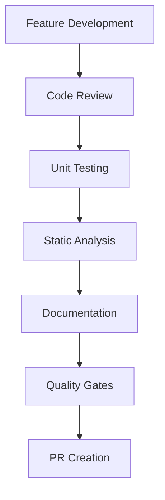
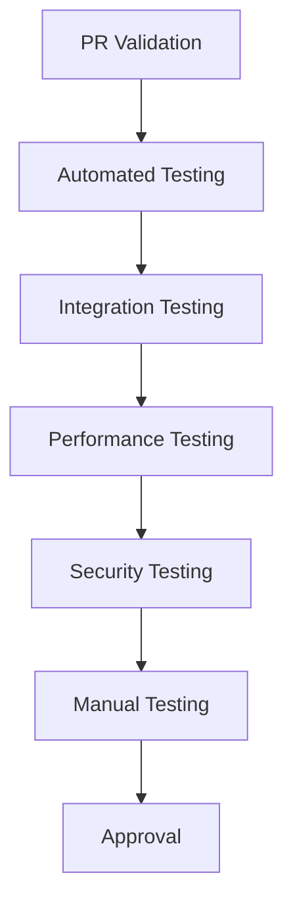
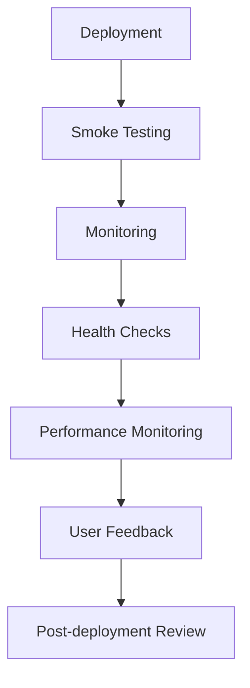

# Quality Assurance Guide

**Version**: 1.0  
**Last Updated**: 2026-03-01  
**Purpose**: Comprehensive QA strategy, current issues, and future enhancements for the Mystira monorepo

## Overview

This guide establishes the complete quality assurance strategy for the Mystira monorepo, covering code quality, testing, documentation, performance, security, and operational excellence. It serves as the central reference for maintaining and improving quality across all projects and languages.

## Current Quality Landscape

### 📊 **Quality Metrics Dashboard**

#### **Code Quality**
- **TreatWarningsAsErrors**: ✅ 100% implementation (34/34 projects)
- **Build Success**: ✅ 0 warnings, 0 errors across all projects
- **Code Coverage**: 🔄 Targeting 80% across all languages
- **Linting**: ✅ Enforced for TypeScript, partial for C#

#### **Testing Coverage**
- **C# Projects**: 28 test projects, comprehensive coverage
- **TypeScript Projects**: 5/15 projects with tests (33% coverage)
- **Rust Projects**: 0/1 projects with tests (0% coverage)
- **E2E Tests**: Limited coverage across applications

#### **Documentation Quality**
- **ADR Process**: ✅ Established and active
- **PR Documentation**: ✅ Strategy and tools implemented
- **API Documentation**: 🔄 Partial coverage
- **User Documentation**: 🔄 Limited coverage

#### **Performance**
- **Build Times**: 🔄 Variable across projects
- **Test Execution**: 🔄 No performance benchmarking
- **Runtime Performance**: 🔄 Limited monitoring

## Current Quality Issues

### 🔴 **Critical Issues**

#### **1. TypeScript Test Coverage Gap**
- **Impact**: 10/15 TypeScript packages have no tests
- **Risk**: Undetected bugs, regression issues
- **Priority**: High
- **Effort**: Medium-High

#### **2. Rust Testing Infrastructure**
- **Impact**: No tests for Tauri desktop application
- **Risk**: Critical failures in production
- **Priority**: High
- **Effort**: Medium

#### **3. Performance Monitoring**
- **Impact**: No performance benchmarking or monitoring
- **Risk**: Performance regressions, user experience issues
- **Priority**: High
- **Effort**: Medium

#### **4. E2E Test Coverage**
- **Impact**: Limited end-to-end testing across applications
- **Risk**: Integration failures, user workflow issues
- **Priority**: Medium-High
- **Effort**: High

### 🟡 **Medium Issues**

#### **5. API Documentation**
- **Impact**: Incomplete API documentation across services
- **Risk**: Developer confusion, integration issues
- **Priority**: Medium
- **Effort**: Medium

#### **6. Code Coverage Reporting**
- **Impact**: No unified coverage reporting across languages
- **Risk**: Coverage gaps unnoticed
- **Priority**: Medium
- **Effort**: Low-Medium

#### **7. Security Testing**
- **Impact**: Limited security testing and vulnerability scanning
- **Risk**: Security vulnerabilities
- **Priority**: Medium
- **Effort**: Medium

#### **8. Accessibility Testing**
- **Impact**: No systematic accessibility testing
- **Risk**: Accessibility compliance issues
- **Priority**: Medium
- **Effort**: Medium

### 🟢 **Low Priority Issues**

#### **9. Build Optimization**
- **Impact**: Suboptimal build times and resource usage
- **Risk**: Developer productivity issues
- **Priority**: Low
- **Effort**: Low-Medium

#### **10. Documentation Consistency**
- **Impact**: Inconsistent documentation formats and quality
- **Risk**: Maintenance overhead, confusion
- **Priority**: Low
- **Effort**: Low

## Quality Assurance Strategy

### 🎯 **Quality Pillars**

#### **1. Code Quality**
- **Static Analysis**: Comprehensive linting and static analysis
- **Code Standards**: Consistent formatting and patterns
- **Peer Review**: Thorough code review process
- **Quality Gates**: Automated quality validation

#### **2. Testing Excellence**
- **Unit Testing**: Comprehensive unit test coverage
- **Integration Testing**: Cross-component integration tests
- **E2E Testing**: End-to-end user workflow testing
- **Performance Testing**: Load and performance benchmarking

#### **3. Documentation Quality**
- **Technical Documentation**: Complete technical documentation
- **API Documentation**: Comprehensive API documentation
- **User Documentation**: Clear user-facing documentation
- **Historical Documentation**: Complete change history

#### **4. Operational Excellence**
- **Monitoring**: Comprehensive application monitoring
- **Security**: Security testing and vulnerability management
- **Performance**: Performance monitoring and optimization
- **Reliability**: Reliability testing and incident management

### 🔄 **Quality Assurance Process**

#### **1. Development Phase**

#### **2. Testing Phase**

#### **3. Deployment Phase**

## Implementation Roadmap

### 📅 **Phase 1: Foundation (Weeks 1-4)**

#### **Week 1: Test Infrastructure**
- [ ] Set up unified test reporting
- [ ] Implement TypeScript test templates
- [ ] Create Rust testing infrastructure
- [ ] Establish test coverage thresholds

#### **Week 2: Code Quality Enhancement**
- [ ] Implement comprehensive linting rules
- [ ] Set up automated code quality checks
- [ ] Create code quality dashboards
- [ ] Establish quality gates

#### **Week 3: Documentation Standards**
- [ ] Implement API documentation generation
- [ ] Create documentation templates
- [ ] Set up documentation validation
- [ ] Establish documentation standards

#### **Week 4: Monitoring Setup**
- [ ] Implement application monitoring
- [ ] Set up performance monitoring
- [ ] Create health check endpoints
- [ ] Establish alerting rules

### 📅 **Phase 2: Enhancement (Weeks 5-8)**

#### **Week 5: Testing Expansion**
- [ ] Implement E2E testing framework
- [ ] Create integration test suites
- [ ] Set up performance benchmarking
- [ ] Implement security testing

#### **Week 6: Performance Optimization**
- [ ] Optimize build times
- [ ] Implement caching strategies
- [ ] Optimize test execution
- [ ] Set up performance profiling

#### **Week 7: Security Enhancement**
- [ ] Implement security scanning
- [ ] Set up vulnerability management
- [ ] Create security testing suites
- [ ] Establish security policies

#### **Week 8: Accessibility & Compliance**
- [ ] Implement accessibility testing
- [ ] Set up compliance checking
- [ ] Create accessibility guidelines
- [ ] Establish compliance standards

### 📅 **Phase 3: Excellence (Weeks 9-12)**

#### **Week 9: Advanced Monitoring**
- [ ] Implement distributed tracing
- [ ] Set up advanced alerting
- [ ] Create performance dashboards
- [ ] Establish SLA monitoring

#### **Week 10: Automation Enhancement**
- [ ] Implement automated testing pipelines
- [ ] Set up automated deployment
- [ ] Create automated quality checks
- [ ] Establish automated reporting

#### **Week 11: Quality Metrics**
- [ ] Implement quality metrics collection
- [ ] Set up quality dashboards
- [ ] Create quality reporting
- [ ] Establish quality KPIs

#### **Week 12: Continuous Improvement**
- [ ] Implement quality improvement process
- [ ] Set up quality retrospectives
- [ ] Create quality improvement plans
- [ ] Establish quality culture

## Technology Stack

### 🛠️ **Testing Tools**

#### **C# Testing**
- **xUnit**: Primary testing framework
- **Moq**: Mocking framework
- **FluentAssertions**: Assertion library
- **Coverlet**: Code coverage
- **BenchmarkDotNet**: Performance testing

#### **TypeScript Testing**
- **Vitest**: Primary testing framework
- **Jest**: Compatibility testing
- **Playwright**: E2E testing
- **Cypress**: Alternative E2E testing
- **Testing Library**: Component testing

#### **Rust Testing**
- **Built-in**: Rust's built-in testing
- **Tarpaulin**: Code coverage
- **Criterion**: Benchmarking
- **Mockall**: Mocking framework

### 🔍 **Quality Analysis Tools**

#### **Static Analysis**
- **ESLint**: JavaScript/TypeScript linting
- **Prettier**: Code formatting
- **StyleCop**: C# code analysis
- **Rust Clippy**: Rust linting
- **SonarQube**: Code quality analysis

#### **Security Analysis**
- **OWASP ZAP**: Security scanning
- **Snyk**: Vulnerability scanning
- **Dependabot**: Dependency security
- **Semgrep**: Static security analysis

#### **Performance Analysis**
- **Lighthouse**: Web performance
- **WebPageTest**: Performance testing
- **Apache Bench**: Load testing
- **K6**: Performance testing

### 📊 **Monitoring Tools**

#### **Application Monitoring**
- **Application Insights**: Azure monitoring
- **Prometheus**: Metrics collection
- **Grafana**: Visualization
- **Jaeger**: Distributed tracing

#### **Infrastructure Monitoring**
- **Azure Monitor**: Infrastructure monitoring
- **Log Analytics**: Log analysis
- **Health Checks**: Application health
- **Custom Metrics**: Business metrics

## Quality Metrics and KPIs

### 📈 **Code Quality Metrics**

#### **Coverage Metrics**
- **Unit Test Coverage**: Target 80% minimum
- **Integration Test Coverage**: Target 70% minimum
- **E2E Test Coverage**: Target 60% minimum
- **Branch Coverage**: Target 85% minimum

#### **Code Quality Metrics**
- **Code Smells**: < 5 per 1000 lines
- **Complexity**: Cyclomatic complexity < 10
- **Duplication**: < 3% duplication
- **Technical Debt**: < 2 days per sprint

#### **Documentation Metrics**
- **API Documentation**: 100% coverage
- **Code Comments**: 20% minimum coverage
- **Documentation Quality**: 4/5 average rating
- **Documentation Currency**: < 30 days outdated

### 🚀 **Performance Metrics**

#### **Build Performance**
- **Build Time**: < 5 minutes for full build
- **Incremental Build**: < 30 seconds
- **Test Execution**: < 2 minutes for full suite
- **Deployment Time**: < 10 minutes

#### **Runtime Performance**
- **Response Time**: < 200ms (95th percentile)
- **Throughput**: > 1000 requests/second
- **Error Rate**: < 0.1%
- **Availability**: > 99.9%

#### **Resource Usage**
- **Memory Usage**: < 512MB per service
- **CPU Usage**: < 70% average
- **Disk Usage**: < 80% capacity
- **Network Usage**: < 100MB/s

### 🔒 **Security Metrics**

#### **Vulnerability Metrics**
- **Critical Vulnerabilities**: 0
- **High Vulnerabilities**: < 5
- **Medium Vulnerabilities**: < 20
- **Patch Time**: < 7 days for critical

#### **Compliance Metrics**
- **Security Scans**: 100% coverage
- **Compliance Checks**: 100% pass rate
- **Security Training**: 100% team completion
- **Incident Response**: < 1 hour MTTR

## Future Enhancements

### 🚀 **Advanced Testing**

#### **1. AI-Powered Testing**
- **Test Generation**: AI-generated test cases
- **Test Optimization**: AI-optimized test execution
- **Defect Prediction**: AI-predicted defect detection
- **Test Maintenance**: AI-assisted test maintenance

#### **2. Visual Testing**
- **UI Testing**: Automated visual regression testing
- **Cross-browser Testing**: Comprehensive browser testing
- **Mobile Testing**: Mobile device testing
- **Accessibility Testing**: Automated accessibility testing

#### **3. Contract Testing**
- **API Contracts**: Consumer-driven contract testing
- **Schema Validation**: Automated schema validation
- **Compatibility Testing**: Backward compatibility testing
- **Integration Contracts**: Service integration contracts

### 🔮 **Quality Intelligence**

#### **1. Predictive Quality**
- **Quality Prediction**: ML-based quality prediction
- **Risk Assessment**: Automated risk assessment
- **Quality Trends**: Quality trend analysis
- **Prevention Strategies**: Proactive quality prevention

#### **2. Quality Analytics**
- **Quality Dashboards**: Advanced quality dashboards
- **Trend Analysis**: Quality trend analysis
- **Correlation Analysis**: Quality correlation analysis
- **Root Cause Analysis**: Automated root cause analysis

#### **3. Continuous Quality**
- **Quality Gates**: Advanced quality gates
- **Automated Improvement**: Automated quality improvement
- **Quality Culture**: Quality culture development
- **Quality Metrics**: Advanced quality metrics

### 🛡️ **Security Enhancement**

#### **1. Advanced Security**
- **Threat Modeling**: Automated threat modeling
- **Security Testing**: Advanced security testing
- **Vulnerability Management**: Proactive vulnerability management
- **Security Monitoring**: Advanced security monitoring

#### **2. Compliance Automation**
- **Compliance Checking**: Automated compliance checking
- **Audit Trails**: Comprehensive audit trails
- **Regulatory Compliance**: Automated regulatory compliance
- **Security Policies**: Automated security policy enforcement

### ⚡ **Performance Optimization**

#### **1. Performance Engineering**
- **Performance Profiling**: Advanced performance profiling
- **Load Testing**: Comprehensive load testing
- **Performance Monitoring**: Advanced performance monitoring
- **Performance Optimization**: Automated performance optimization

#### **2. Scalability Testing**
- **Load Testing**: Scalability load testing
- **Stress Testing**: Stress testing
- **Capacity Planning**: Automated capacity planning
- **Resource Optimization**: Resource optimization

## Quality Assurance Culture

### 🎯 **Quality Principles**

#### **1. Quality First**
- **Prevention over Detection**: Prevent defects rather than detect them
- **Quality Ownership**: Everyone owns quality
- **Continuous Improvement**: Continuously improve quality
- **Customer Focus**: Focus on customer quality requirements

#### **2. Data-Driven Quality**
- **Metrics-Driven**: Use metrics to drive quality decisions
- **Evidence-Based**: Use evidence for quality improvements
- **Trend Analysis**: Analyze quality trends
- **Benchmarking**: Benchmark against industry standards

#### **3. Collaborative Quality**
- **Team Responsibility**: Shared quality responsibility
- **Knowledge Sharing**: Share quality knowledge
- **Peer Review**: Collaborative peer review
- **Quality Communities**: Quality communities of practice

### 📚 **Training and Development**

#### **1. Quality Training**
- **Quality Fundamentals**: Basic quality training
- **Advanced Quality**: Advanced quality techniques
- **Tool Training**: Quality tool training
- **Best Practices**: Quality best practices

#### **2. Skill Development**
- **Technical Skills**: Quality technical skills
- **Soft Skills**: Quality soft skills
- **Leadership Skills**: Quality leadership skills
- **Communication Skills**: Quality communication skills

#### **3. Knowledge Management**
- **Quality Documentation**: Quality knowledge documentation
- **Lessons Learned**: Quality lessons learned
- **Best Practices**: Quality best practices
- **Knowledge Sharing**: Quality knowledge sharing

## Risk Management

### ⚠️ **Quality Risks**

#### **Technical Risks**
- **Quality Regression**: Quality regression risks
- **Performance Degradation**: Performance degradation risks
- **Security Vulnerabilities**: Security vulnerability risks
- **Compatibility Issues**: Compatibility issue risks

#### **Process Risks**
- **Quality Gaps**: Quality gap risks
- **Resource Constraints**: Resource constraint risks
- **Timeline Pressure**: Timeline pressure risks
- **Skill Gaps**: Skill gap risks

#### **Business Risks**
- **Customer Impact**: Customer impact risks
- **Reputation Damage**: Reputation damage risks
- **Financial Impact**: Financial impact risks
- **Competitive Disadvantage**: Competitive disadvantage risks

### 🛡️ **Risk Mitigation**

#### **Prevention Strategies**
- **Quality Standards**: Comprehensive quality standards
- **Quality Gates**: Automated quality gates
- **Continuous Monitoring**: Continuous quality monitoring
- **Proactive Testing**: Proactive quality testing

#### **Detection Strategies**
- **Quality Monitoring**: Real-time quality monitoring
- **Automated Testing**: Comprehensive automated testing
- **Quality Metrics**: Quality metric monitoring
- **Alert Systems**: Quality alert systems

#### **Response Strategies**
- **Incident Response**: Quality incident response
- **Root Cause Analysis**: Root cause analysis
- **Corrective Actions**: Corrective action planning
- **Preventive Measures**: Preventive measure implementation

## Governance and Compliance

### 📋 **Quality Governance**

#### **Quality Policies**
- **Quality Policy**: Comprehensive quality policy
- **Quality Standards**: Quality standards documentation
- **Quality Procedures**: Quality procedure documentation
- **Quality Guidelines**: Quality guidelines

#### **Quality Roles**
- **Quality Owner**: Quality ownership roles
- **Quality Champions**: Quality champion roles
- **Quality Teams**: Quality team structures
- **Quality Committees**: Quality committee structures

#### **Quality Processes**
- **Quality Planning**: Quality planning processes
- **Quality Control**: Quality control processes
- **Quality Assurance**: Quality assurance processes
- **Quality Improvement**: Quality improvement processes

### 📊 **Compliance Management**

#### **Regulatory Compliance**
- **Compliance Requirements**: Regulatory compliance requirements
- **Compliance Monitoring**: Compliance monitoring processes
- **Compliance Reporting**: Compliance reporting processes
- **Compliance Audits**: Compliance audit processes

#### **Industry Standards**
- **ISO Standards**: ISO standard compliance
- **Industry Best Practices**: Industry best practice adoption
- **Benchmarking**: Industry benchmarking
- **Certification**: Quality certification processes

## Conclusion

This Quality Assurance Guide provides a comprehensive framework for maintaining and improving quality across the Mystira monorepo. By implementing the strategies, tools, and processes outlined in this guide, we can ensure:

1. **Consistent Quality**: Consistent quality across all projects and languages
2. **Continuous Improvement**: Ongoing quality improvement and optimization
3. **Risk Mitigation**: Proactive risk identification and mitigation
4. **Customer Satisfaction**: High-quality products that meet customer needs
5. **Team Excellence**: Quality-focused development culture

The success of this quality assurance strategy depends on:
- **Leadership Support**: Strong leadership commitment to quality
- **Team Engagement**: Active team participation in quality initiatives
- **Continuous Learning**: Ongoing learning and skill development
- **Process Adherence**: Consistent adherence to quality processes
- **Measurement and Monitoring**: Regular measurement and monitoring of quality metrics

By following this guide and continuously improving our quality practices, we can achieve excellence in software quality and deliver outstanding products to our users.

---

**Quality Team**: Development Team  
**Review Schedule**: Monthly  
**Last Review**: 2026-03-01  
**Next Review**: 2026-04-01
